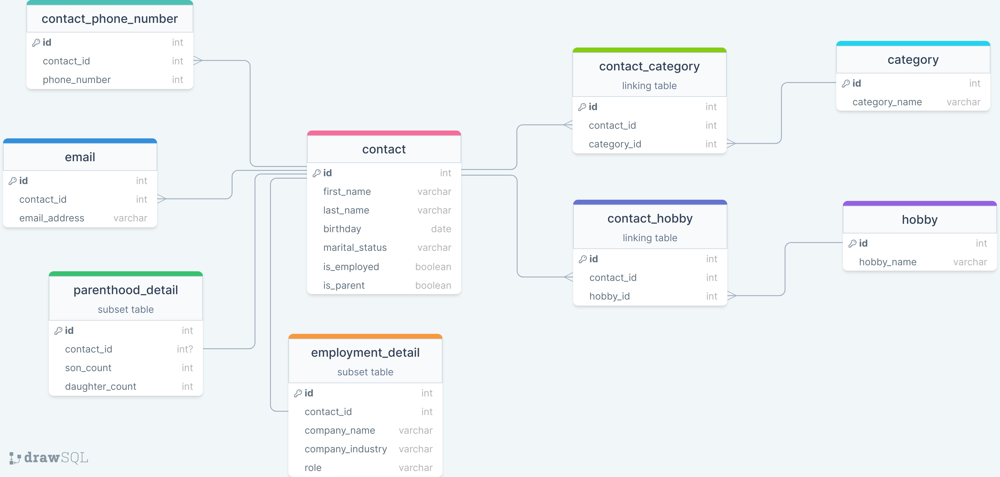

# fullstack-address-book

REST API

- GET api/contact get all contacts
- POST api/contact add a contact
- GET api/contact/:first_name get contact by first name
- DELETE api/contact delete all contact data

ERD

